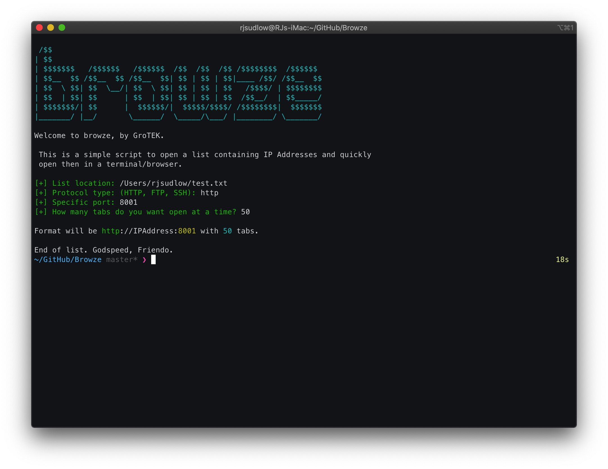

# browze
[](https://www.python.org/)
[](https://forthebadge.com)

Python script used to read a list of IP addresses and view them in a browser. Has support for web protocols, with FTP support as well. If you want even more granularity, you can pass it a specific port in a protocol and access that
(i.e., http://ip.address:9001).

## Download
```
git clone https://github.com/rjsudlow/browze
```

## Setup
Only one requirement [colorama](), which may already be installed. Check for the install by:

```
python3 setup.py install
```
## Usage
```
python3 browze.py
```

## Images


This project is licensed under the GPLv3 License - see the [LICENSE](LICENSE) file for details.
### To Do:
* Add FTP in browser support
* Add SSH support

## Disclaimer
>This should go without saying, but this tool is for academic purposes only. I'm not responsible if you want to use this
for nefarious deeds. Please pay special attention to all local, state, and federal laws. Remember:
"With great power comes great responsibility."
